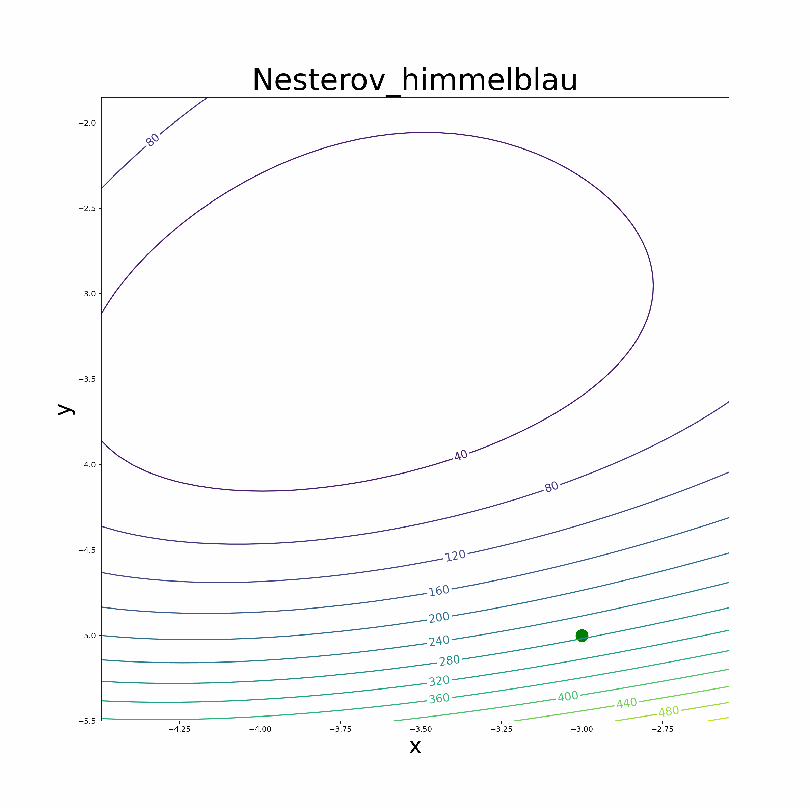
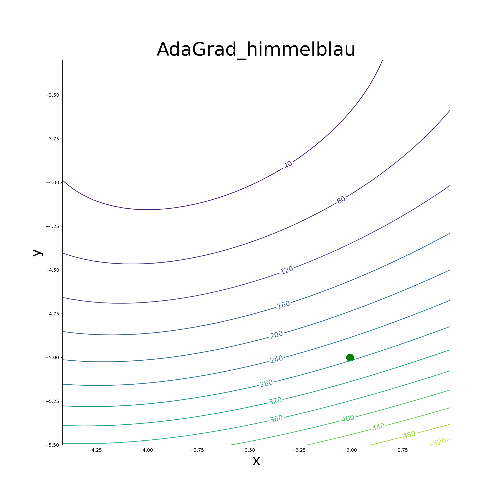
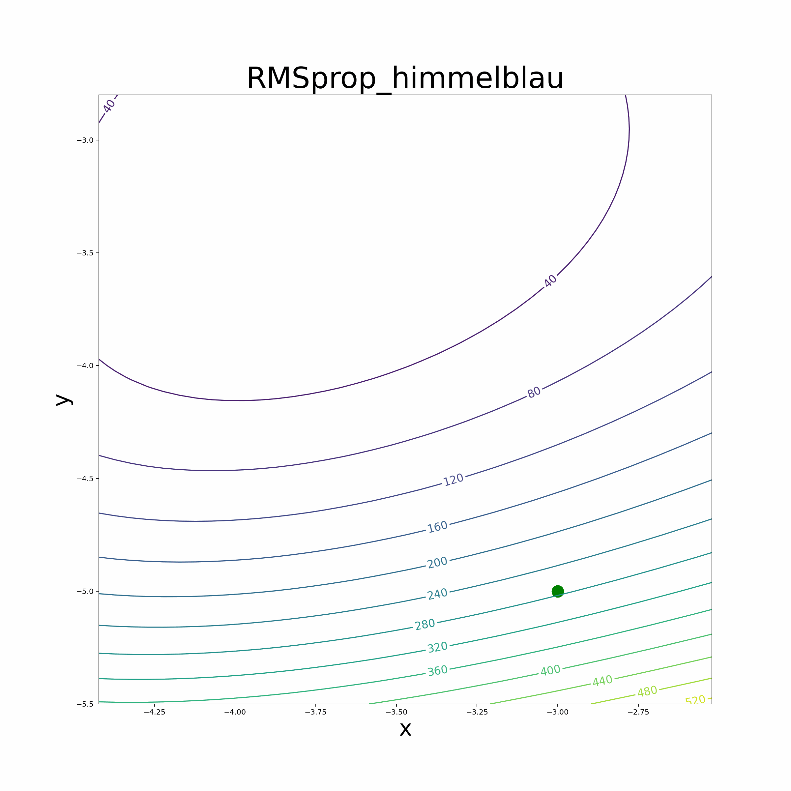
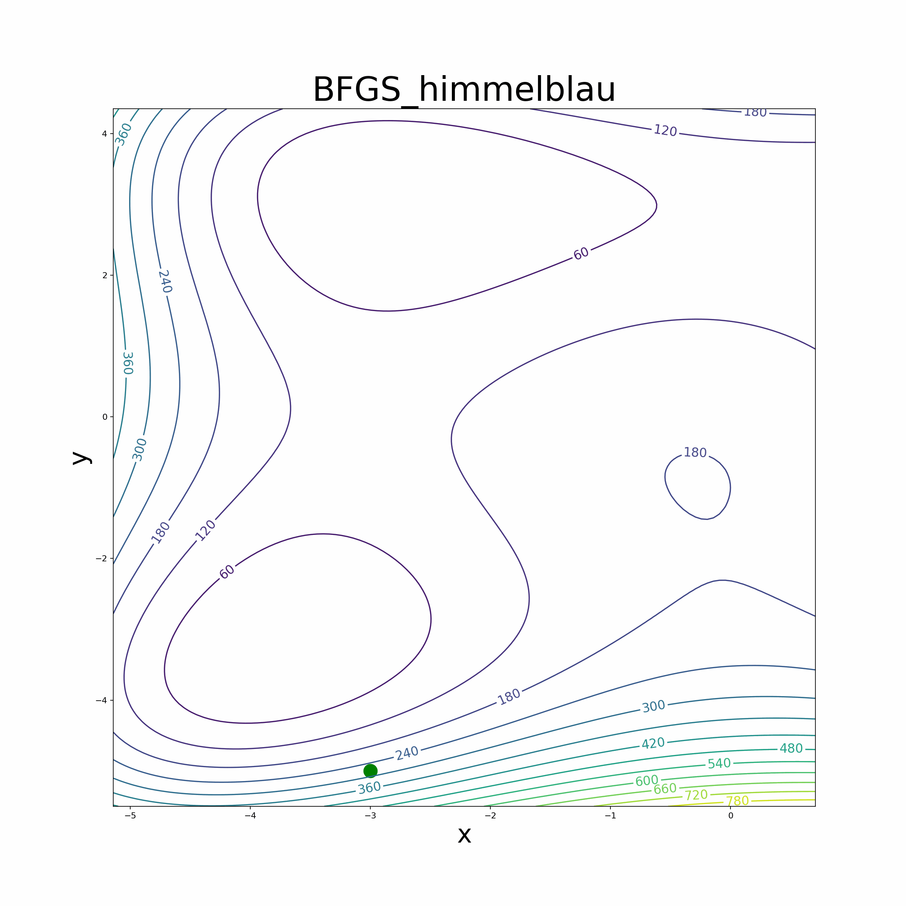
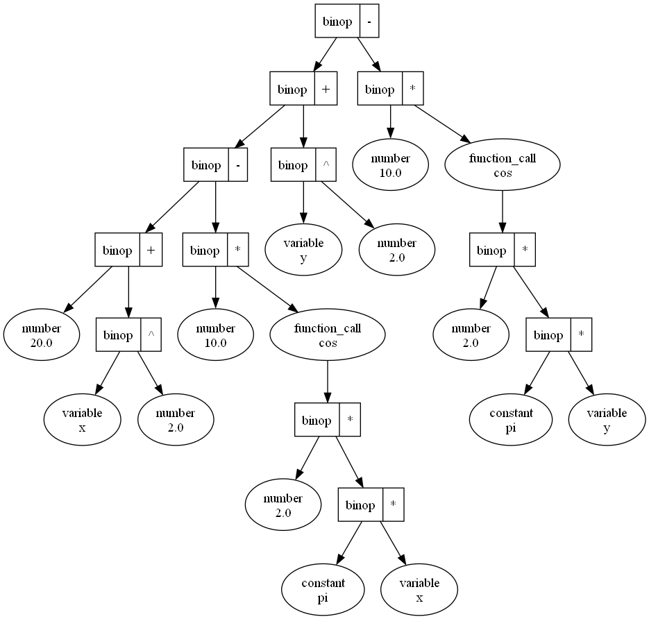
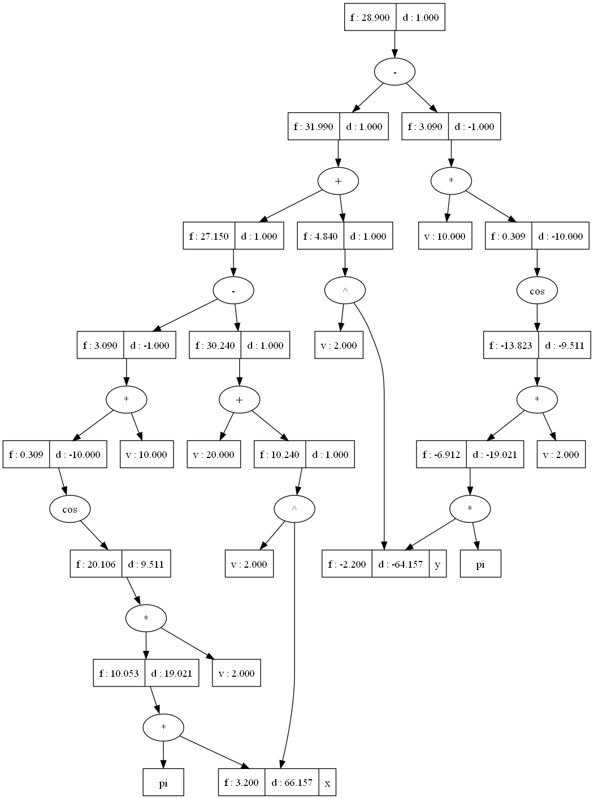

# Automatic Differentiation Library (Reverse Mode)
## Introduction
The purpose of this project is to implement an Automatic Differentiation (AD) library using the reverse mode, a powerful technique that efficiently computes gradients of functions. The motivation behind this implementation is to address the limitations of numeric difference methods, which can introduce errors in gradient calculations. The AD library enables us to accurately and efficiently compute gradients, making it suitable for optimization algorithms like gradient descent.

## Visualization
### Optimization Process

    
    
    

    
    
    

### AST and DAG

    
    
    

- The figure on the left represents the Abstract Syntax Tree (AST) built from the Rastrigin Function. The AST is a hierarchical representation of the mathematical expression, where each node corresponds to an operator or operand, and the edges represent the relationships between them.

- The figure in the middle is the Directed Acyclic Graph (DAG) formed using the AST Parser. The DAG is derived from the AST and is used to optimize the evaluation of the expression during automatic differentiation. It represents the same expression as the AST but in a more efficient form, eliminating redundant calculations and reducing memory usage.

- The figure on the right is the DAG formed using the Postfix Parser. Like the middle figure, this DAG also represents the same expression as the AST but with a different order of evaluation between the operators that have the same precedence. This difference in evaluation order does not affect the final result of the calculation; it only impacts the sequence in which certain operations are performed.

- Both DAG figures serve the same purpose, which is to facilitate automatic differentiation and gradient computation for optimization algorithms. They represent the computational graph of the expression, which allows efficient computation of derivatives with respect to the variables in the expression.

## Features
- Reverse Mode Automatic Differentiation: The library implements reverse mode AD, a technique that efficiently computes gradients for a given mathematical function.
- Math Expression Parser: The library provides two parsers to read mathematical expressions in string literals and transform them into functions compatible with automatic differentiation. One parser is based on Abstract Syntax Tree (AST), and the other one uses the Shunting Yard Algorithm and Postfix Evaluation.
- Optimization Algorithms: Apply the automatic differentiation library to implement various optimization algorithms, including:
    - [Vanilla Gradient Descent](https://en.wikipedia.org/wiki/Gradient_descent)
    - [Momentum-based Gradient Descent](https://optimization.cbe.cornell.edu/index.php?title=Momentum)
    - [Nesterov-based Gradient Descent](https://www.codingninjas.com/studio/library/nesterov-accelerated-gradient)
    - [AdaGrad Optimizer](https://optimization.cbe.cornell.edu/index.php?title=AdaGrad)
    - [RMSprop Optimizer](https://optimization.cbe.cornell.edu/index.php?title=RMSProp)
    - [Adam Optimizer](https://optimization.cbe.cornell.edu/index.php?title=Adam)
    - [BFGS Algorithm](https://en.wikipedia.org/wiki/Broyden%E2%80%93Fletcher%E2%80%93Goldfarb%E2%80%93Shanno_algorithm#Algorithm)

## Implementation Details
### Reverse Mode Automatic Differentiation
A class called Var is implemented to represent variables or constant and their gradients during the forward and backward passes. The core of the library involves overloading arithmetic operators (+, -, *, /, **) to support the computation of gradients during automatic differentiation.
At the same time, common used math function (Var version) such as sin, cos, tan are also being implemented. The library also provides a function "draw_dag" to visualize the relationship between the gradient of the variables etc. (Graphviz need to be installed)

### Math Expression Parsers
- AST-based
- Shunting Yard Algorithm and Postfix Evaluation-based 

Both parsers are designed to tokenize the mathematical expression, breaking it down into individual components such as math functions, math constants, operators, parentheses, and variables (a-zA-Z). Once the expression is tokenized, both parsers generate two Python functions: one for automatic differentiation and another for normal mathematical calculations.

The automatic differentiation function leverages the reverse mode of automatic differentiation, enabling efficient computation of gradients for the given mathematical expression. This is particularly beneficial for optimization algorithms, as it accurately calculates gradients without relying on numerical difference methods, which can introduce errors.

On the other hand, the second Python function produced by the parser performs standard mathematical calculations for the given expression. This function is suitable for evaluating the expression and obtaining the final result without the need for gradient information.

By providing both automatic differentiation and standard calculation functions, the parsers offer a comprehensive solution for handling mathematical expressions. Users can easily choose between the two functions depending on their specific requirements, whether it's optimizing the function using gradient-based algorithms or simply obtaining the result of the expression.

In summary, these parsers efficiently tokenize and transform mathematical expressions into Python functions, empowering users to seamlessly incorporate automatic differentiation capabilities into their optimization algorithms and perform accurate mathematical computations.
Optimization Algorithms
We leverage the automatic differentiation library to implement various optimization algorithms, making it easier for users to optimize their custom mathematical functions. The implemented optimization algorithms include popular methods like vanilla gradient descent, Adam optimizer, RMSprop optimizer, momentum-based gradient descent, and the BFGS algorithm.

### Optimization Algorithms
Leverage the automatic differentiation library to implement various optimization algorithms, making it easier for users to optimize their custom mathematical functions. The implemented optimization algorithms include popular methods like vanilla gradient descent, momentum-based gradient descent, RMSprop optimizer, Adam optimizer and the BFGS algorithm.

### Structure of the repository
- [`Var.py`](Var.py):

    - This file contains the core of the Automatic Differentiation (AD) library. It includes the implementation of the main class "Var" which is responsible for representing variables in the expression. The file also contains the functions for forward propagation, backward propagation, and drawing the Directed Acyclic Graph (DAG) between Var objects.
        - forward: The forward function efficiently updates the value and gradient of each Var object constructed from the expression. Instead of repeatedly constructing and destructing objects, it optimizes the process by updating values in-place.
        - backward: The backward function performs backpropagation to propagate the gradient through the expression, efficiently calculating the gradients of each variable with respect to the output.
        - draw_dag: The draw_dag function allows for visualizing the DAG that shows the dependencies between the Var objects.
- [`VarMath.py`](VarMath.py):

    - This file contains the implementation of math functions compatible with Var objects. It defines functions that can work with Var objects and compute their values and gradients correctly.
- [`ParserAST.py`](ParserAST.py):

    - This file implements the Abstract Syntax Tree (AST) to convert mathematical expressions in string literals into Python functions. The parser builds an AST representation of the expression, which is then used to create Python functions for automatic differentiation and standard math calculations.
draw_ast: The draw_ast function enables visualization of the AST that is built from the mathematical expression.
- [`ParserPostfix.py`](ParserPostfix.py):

    - This file implements the Shunting-Yard Algorithm and Postfix Evaluation Algorithm to convert mathematical expressions in string literals into Python functions. The parser first transforms the expression from infix notation into postfix notation and then evaluates it to create the Python functions for automatic differentiation and standard math calculations.
- [`graDescending.py`](graDescending.py):

    - This file implements various Gradient Descent Algorithms, including:
        - [Vanilla Gradient Descent](https://en.wikipedia.org/wiki/Gradient_descent)
        - [Momentum-based Gradient Descent](https://optimization.cbe.cornell.edu/index.php?title=Momentum)
        - [Nesterov-based Gradient Descent](https://www.codingninjas.com/studio/library/nesterov-accelerated-gradient)
        - [AdaGrad Optimizer](https://optimization.cbe.cornell.edu/index.php?title=AdaGrad)
        - [RMSprop Optimizer](https://optimization.cbe.cornell.edu/index.php?title=RMSProp)
        - [Adam Optimizer](https://optimization.cbe.cornell.edu/index.php?title=Adam)
        - [BFGS Algorithm](https://en.wikipedia.org/wiki/Broyden%E2%80%93Fletcher%E2%80%93Goldfarb%E2%80%93Shanno_algorithm#Algorithm)
    - The file also provides an animate function to visualize the optimization process.
- [`main.py`](main.py):
    - This file serves as a test bed for the AD library. It contains tests with several functions, including:
        - Sphere Function
        - [Himmelblau Function](https://en.wikipedia.org/wiki/Himmelblau%27s_function)
        - [Ackley Function](https://en.wikipedia.org/wiki/Ackley_function)
        - [Rastrigin Function](https://en.wikipedia.org/wiki/Rastrigin_function)
        - [Rosenbrock Function](https://en.wikipedia.org/wiki/Rosenbrock_function)

